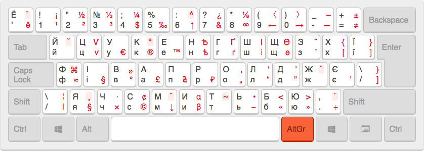
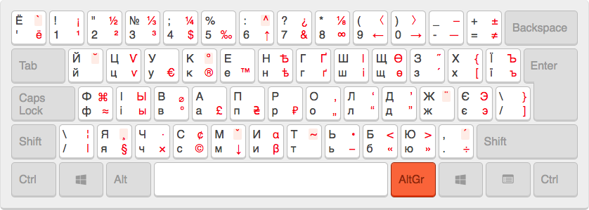
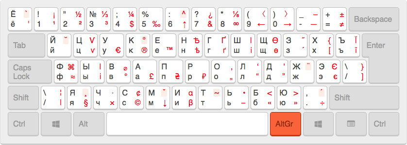

# Сумісні українські типографічні розкладки для Windows/Mac/Ubuntu.

Дані розкладки базуютьсян на типографічній розкладці [Іллі Бірмана](https://ilyabirman.ru/projects/typography-layout/), з де-якими модифікаціями, які полегшують роботу з програмним кодом (наприклад, трикутні лапки).

### Лише українська



Ця розкладка дозволяє вводити корисні символи, використовуючи правий <kbd>Alt</kbd> (який також називають AltGr). Наприклад, щоб отримати знак євро **€**, вам потрібно натиснути <kbd>AltGr</kbd> + <kbd>У</kbd>. Додатковий ряд символів доступний при натисканні ще і Shift-у, наприклад <kbd>AltGr</kbd> + <kbd>З</kbd> дасть знак копірайту **©**, а <kbd>AltGr</kbd> + <kbd>Shift</kbd> + <kbd>З</kbd> дасть знак цента **¢**.

Як і оригінал, ця розкладка підтримує введення акцентів (ӑ), наголосів (а́), умлаутів (ӓ) та ін. через «мертві клавіші». Наприклад, ви хочете отримати літеру **ў**:

**Надрукувати літеру вже з акцентом:** натисніть і відпустіть <kbd>AltGr</kbd> + <kbd>Shift</kbd> + <kbd>й</kbd>, а потім <kbd>у</kbd>.

**Додати акцент до літери:** поставте курсор після надрукованої літери **у**, і натисніть <kbd>AltGr</kbd> + <kbd>Shift</kbd> + <kbd>й</kbd> двічі. Цей спосіб не працює в Ubuntu.


### Базова українська + російська

Ця розкладка включає російскі літери, яких немає на українській розкладці (ы, э, ъ, ё). Ці літери розташовані на тих же місцях, що і в російській розкладці, тому вам достатньо зажати <kbd>AltGr</kbd>, щоб їх надрукувати. Наприклад, <kbd>AltGr</kbd> + <kbd>і</kbd> видасть літеру *ы*. Єдина незручність буде з маленькою літерою **ё**, яку через брак місця в розкладці прийдеться набирати через <kbd>AltGr</kbd> + <kbd>Shift</kbd> + <kbd>'</kbd>.




### Базова російська + українська

В цій розкладці базовою є російська мова, а українські літери можна друкувати через <kbd>AltGr</kbd>.




## Установка

#### Windows

1. Скачайте цей репозиторій на свій комп'ютер.
2. Зайдіть в папку Windows/dst та виберіть одну з розкладок.
3. Запустіть файл setup.exe та виконуйте інструкції.
4. Активуйте розкладку в опціях клавіатури.

#### Mac

1. Скачайте цей репозиторій на свій комп'ютер.
2. Зайдіть в папку Mac/dst та відкрийте архів з розкладками.
3. Перетягніть розкладки в папку-ссилку, доступну всередині архіву.
4. Зайдіть в System preferences > Keyboard > Input Sources та активуйте нові розкладки. Їх можна знайти, всередині группи украінської та російської мов.

#### Linux

1. Скопіюйте команду наведену нижче, включаючи останній слеш:

    ```
    sudo apt-get -qq -y install wget && \
    wget -q -O /tmp/ukrainian-typographic-layouts.tar.gz https://github.com/neochief/ukrainian-typographic-layouts/archive/master.tar.gz && \
    tar xf /tmp/ukrainian-typographic-layouts.tar.gz -C /tmp && \
    /tmp/ukrainian-typographic-layouts/Ubuntu/install.sh
    /
    ```

2. Відкрийте термінал (Ctrl + Alt + T), вставте команду і натисніть клавішу Enter.

    Ця команда встановить і включить обидві розкладки в системі, активує клавішу альтернативних символів (правий Alt), а також (опціонально) встановить перемикання розкладок через Alt + Shift.

3. Дочекайтеся зеленого повідомлення про успіх. В процесі установки може знадобитися введення пароля.


## Інші розкладки

- Англійську типографічну розкладку можна взяти у [Іллі Бірмана](https://ilyabirman.ru/projects/typography-layout/).

- Англійська та російська [розкладки Іллі Бірмана для Ubuntu](https://github.com/neochief/birman-typography-layouts-for-ubuntu).

## Питанная

- Більшість питань по розкладкам можна дізнатися [тут](https://ilyabirman.ru/projects/typography-layout/faq/).